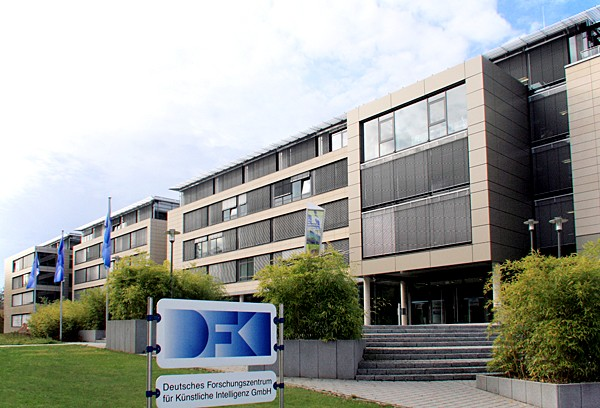
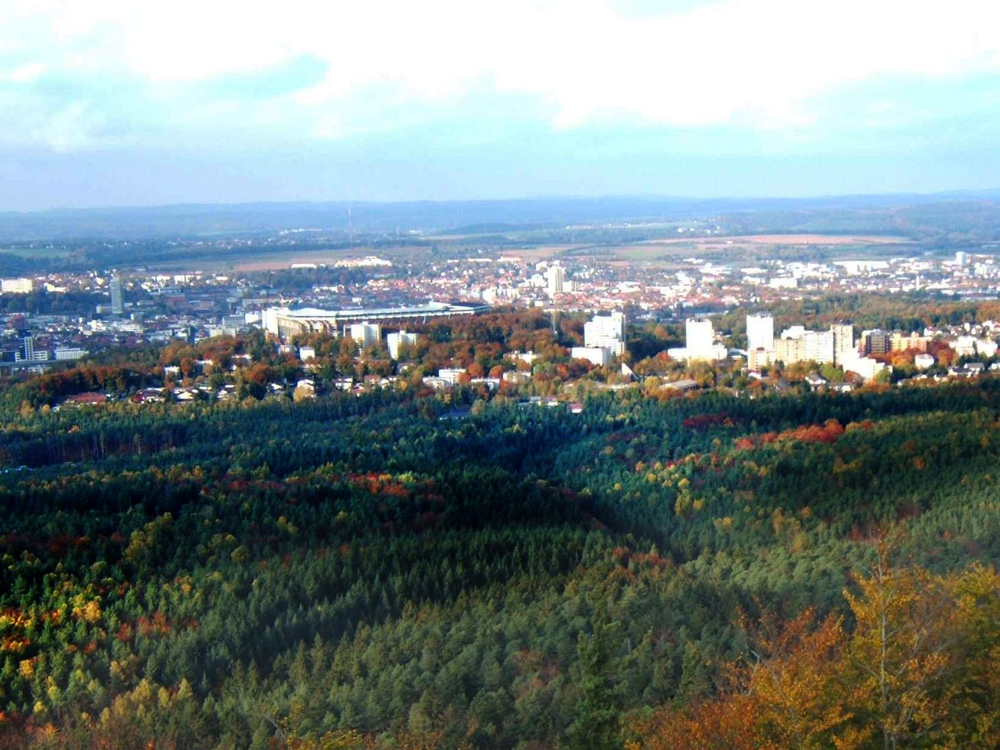
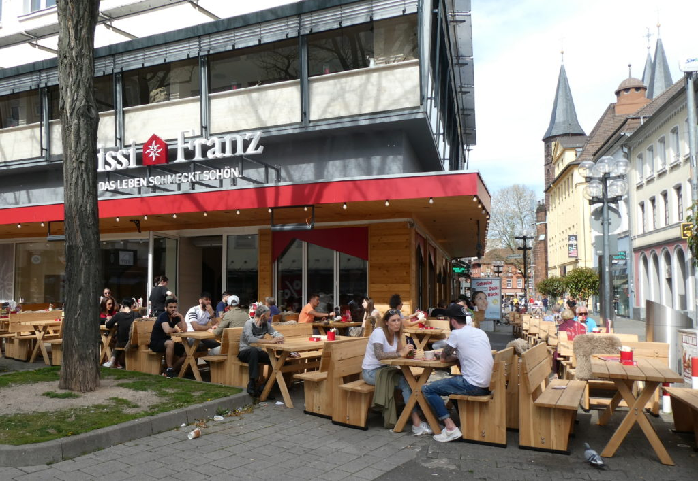
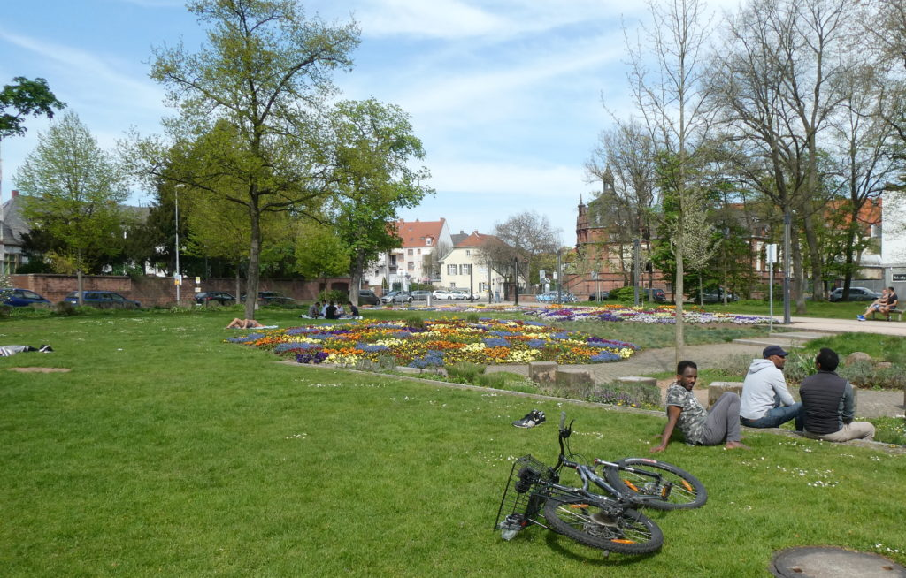
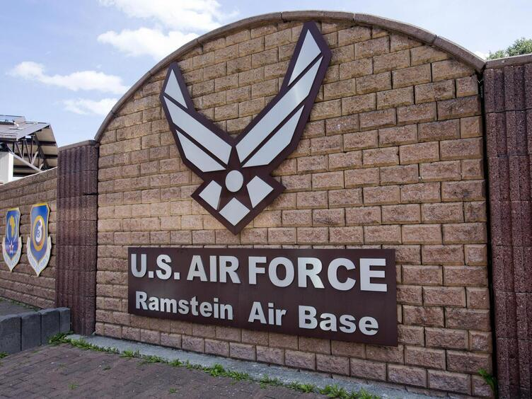

*Pushing the boundaries of ML/AI to tackle the problems that really matter*

After 12 years in the UK I moved back to the UK to lead a research group at the Univeristy of Kaiserlautern and the German Centre for Artificial Intelligence. We are hiring on all levels MSc, PhD students but also postdoctoral fellows and group leader.

# Open Positions (remote options possible!) Respond by 30.11
# [Submit your interest here!](https://forms.office.com/r/CWNtPWXdLr)

## Senior Researcher/Group Leader
Are you excited by this lab's research directions and want to lead your own research agenda and grant income? Our group and DFKI is an excellent place for you.
## Postdoctoral Fellows
If you have completed or are about to complete your PhD and are interested in our projects, get in touch. We can be a great springboard into industry, to create [startups](https://www-live.dfki.de/en/web/technologies-applications/industry/spin-offs) and be the first step of an academic career.
## PhD stipends
If you are excited by our past research or the topics mentioned, please get in touch.
1700€ per month stipend + potentially academic assitant position (HIWI)

## MSc stipends (international students are very welcome)
We predominantly hire PhDs and Postdocs, but if you are highly motivated and see exceptional synergy with our group, please be in touch.

You need to apply via https://applymsc.informatik.uni-kl.de/ to be admitted but get in touch before.

You need to apply via [https://applymsc.informatik.uni-kl.de/](https://applymsc.informatik.uni-kl.de/) to be addmited to MSc but get in touch before.
# [Submit your interest here!](https://forms.office.com/r/CWNtPWXdLr)

# Sample project

Survival/time-to-event analysis is an important field of Statistics concerned with understanding the distribution of events over time. Survival analysis presents a unique challenge as we are also interested in events that do not take place, which we refer to as ‘censoring’. Survival analysis methods are important in many real-world settings, such as healthcare (disease prognosis), finance and economics (risk of default), commercial ventures (customer churn), engineering (component lifetime), and many more. Recently there has been an increased interest in applying machine learning to survival analysis in order to make more powerful predictions. 
We encourage successful candidates to explore areas of machine learning within survival analysis that are of interest to them and to pursue novel methods. We also encourage open-source software development in R or Julia. In particular, the candidate will be expected to contribute to the survival analysis development in [MLJ](https://alan-turing-institute.github.io/MLJ.jl/dev/). As well as advances in model development, research will also be expected to explore practical aspects of model comparison including validation and benchmarking. This comprehensive programme will ensure any successful candidate is an expert in machine learning survival analysis.
Successful candidates will work on cutting-edge research with access to state-of-the-art technology and will be at the forefront of survival analysis research. The project will further allow the candidate to develop the necessary skills to become an independent researcher by encouraging novel ideas and methods, as well as helping the candidate grow their own network of academics across the world.

# Selected International Colloaborators 
 - [Bernd Bischl (Fraunhofer & München)](https://www.slds.stat.uni-muenchen.de/people/bischl/)
 - [Spiros Denaxas (UCL)](https://denaxaslab.org)
 - [Hong Ge](https://www.google.com/search?client=safari&rls=en&q=hong+cambridge&ie=UTF-8&oe=UTF-8) 
 - [Andrew Duncan (Imperial College)](https://www.ma.imperial.ac.uk/~aduncan/)
 - [Rayid Ghani (CMU)](http://www.rayidghani.com)
 - [Chris Holmes (Oxford & Alan Turing Institute)](http://www.stats.ox.ac.uk/~cholmes/)
 - [Louis Aslett (Durham & Alan Turing Institute)](http://www.louisaslett.com)
 - [Laster Mackey (Stanford & Microsoft) ](https://web.stanford.edu/~lmackey/)
 - [Yee Whye Teh (Oxford & Deep Mind)](https://www.stats.ox.ac.uk/~teh/)
 
 
 

# University and Institute

# Life at Kaiserslautern

Kaiserslautern has an international flair and is situated close to the French and Luxembourgian borders. This town lies in the middle of the low-lying mountain range known as the Pfälzerwald, or Palatinate Forest. The science centre is renowned for technology and innovation. With everything close at hand, it's an ideal place to study.

With the motto "Life tastes nice" - there is a vibrant restaurant and cafe area in Kaiserslautern [https://www.youtube.com/watch?v=y3bIaPIkRB4](https://www.youtube.com/watch?v=y3bIaPIkRB4)

Nice parks around the city such the city park and the Gartenschau

Ramstein Air Base is located in the German state of Rhineland-Palatinate (aka Rheinland-Pfalz) and is part of the Kaiserslautern Military Community -- the largest American community outside of the United States.
