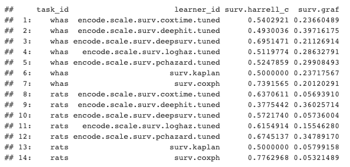
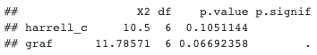
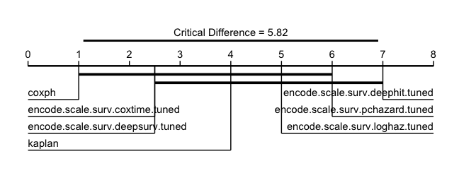

# Neural Networks for Survival Analysis in R

I have received many questions about survival neural networks ('survival networks') in R, ranging from "is this even possible?" to "how do I install Python in R?" and "how can I tune these models?". If you are an R user with an interest in survival networks then this is the article for you! This is not a tutorial of how to use the relevant packages but a demonstration to answer these questions.

This is an advanced demonstration and I'm going to assume you know: i) what survival analysis is; ii) what neural networks are (and common hyper-parameters); iii) basic machine learning (ML) methods like resampling and tuning. I'm happy to cover these topics fully in future articles if requested.

In this article we will cover how to: i) install Python modules in R; ii) use models implemented in {survivalmodels}1 with {mlr3proba}2 ; iii) tune models with {mlr3tuning}3 and preprocess data with {mlr3pipelines}4; iv) benchmark and compare models in {mlr3proba}; v) analyse results in {mlr3benchmark}5. Many of these packages live in the mlr3 family and if you want to learn more about them I'd recommend starting with the mlr3book6.

The code in this demonstration is a 'toy' example with choices made to run the code quickly on my very old laptop, all models are expected to perform poorly.

Let's get deep learning!

## Installing Packages
We will be using several packages, to follow along make sure you install the following:

For this demonstration I used the following package versions: ggplot (v3.3.2); mlr3benchmark (v0.1.2); mlr3extralearners (v0.3.5); mlr3pipelines (v0.3.4); mlr3proba (v0.3.2); mlr3tuning (v0.8.0); survivalmodels (v0.1.7).

## survivalmodels

The package {survivalmodels} currently contains the neural networks:

* CoxTime7
* DeepHit8
* DeepSurv9
* Logistic-Hazard10,11
* PCHazard11
* DNNSurv12

The first five of these use {reticulate}13 to connect the great Python {pycox}14 package, written by Håvard Kvamme, this means you can use neural networks in R with the speed of Python. DNNSurv uses the R {keras}15 package.

In this article, we're just going to look at the first five as they are better established in the literature and they have an identical interface, which simplifies tuning as we will see below. No description of the networks is provided in this article but if this is requested then I am happy to describe these in detail in future posts.

## Using Python in R

To use the Python models in {survivalmodels} you need to set up a Miniconda environment within R and install the required Python modules. Installing the required modules is possible with functions from {survivalmodels}:

`install_pycox` uses `reticulate::py_install` to install the Python packages {pycox} and optionally {torch}16 (`install_torch = TRUE`). install_keras will install {keras} and optionally {tensorflow}17 (`install_tensorflow = TRUE`).

## Setting Seeds

Ensuring reproducible results from models implemented in Python is slightly more tricky than usual as seeds have to be set in multiple places. {survivalmodels} simplifies this with one function called `set_seed`.

## mlr3proba

To run these models once they're installed, we're going to use a different interface. {survivalmodels} has limited functionality, which is okay for basic model fitting/predicting, but neural networks typically require data pre-processing and model tuning, so instead we're going to use {mlr3proba}, which is part of the {mlr3}18 family of packages and includes functionality for probabilistic supervised learning, of which survival analysis is a part of. {mlr3} packages use the R619 interface for object-oriented machine learning in R. Full tutorials for mlr3 can be found in the {mlr3book} and there is also a chapter for survival analysis with {mlr3proba}20.

Now let's set up our experiment!

### Survival data

The first thing we need to do is get some survival datasets for training our models, in {mlr3proba} datasets are saved in tasks which include information about features and targets. We will use one task that comes with {mlr3proba}, `whas`, and one which we'll set up ourselves (though is also already available in {mlr3proba}, this is just for example).

### Getting and tuning learners

Now the part you are here for! We are going to train and tune the Pycox neural networks in {survivalmodels} (all but DNNSurv). Tuning is handled by the {mlr3tuning} package. We are not going to specify a custom architecture for the models but will instead use the defaults, if you are familiar with PyTorch then you have the option to create your own architecture if you prefer by passing this to the `custom_net` parameter in the models.

### Hyper-parameter configurations

Training and tuning neural networks is an art but for this article, we are keeping it simple. We're going to tune the neural networks with the following configurations:

* Dropout fraction tuned over [0, 1]
* Weight decay over [0, 0.5]
* Learning rate over [0, 1]
* Number of nodes in a layer over {1,…,32}
* Number of hidden layers over {1,…,4}

To set this up we use the {paradox}21 package (also part of {mlr3}) to create the hyper-parameter search space. All Pycox learners in {survivalmodels} have an identical parameter interface so only one search space has to be provided. In {survivalmodels}, the number of nodes, `num_nodes`, is specified as a vector of any length, which is not directly tunable. Therefore we instead separately tune over the number of nodes in a layer, `nodes`, and the number of layers, `k`, then provide a transformation to combine the two.

Notice that in our transformation we assume the same number of nodes per layer, this is a fairly usual assumption but one could consider more advanced transformations.

We now wrap the learners in an `AutoTuner`, which allows the learner to be easily tuned inside the benchmark experiment. As we are tuning multiple similar learners, we can create a function that makes creating the `AutoTuner` easier. For tuning we use: 2/3 split holdout, c-index optimisation, and 2 iteration random search. These settings should not be used in practice and are just to make things run faster for this demonstration, in practice I usually recommend 3-fold nested cross-validation, `rsmp("cv", folds = 3)` and 60 iteration random search22, `trm("evals", n_evals = 60)`.

Now let's get our learners and apply our function. For all learners we're going to set the following hyper-parameters:

* 30% of nested training data will be held-back as validation data for early_stopping, `frac = 0.3, early_stopping = TRUE`
* Adam optimizer, `optimizer = "adam"`
* A maximum of 10 epochs, `epochs = 10`

As we are using early-stopping the number of epochs would usually be massively increased (say to 100 minimum) but again it's reduced here to run quicker. All other hyper-parameters use the model defaults.

### Pre-processing

All neural networks require some data pre-processing. This is made simple with the {mlr3pipelines} package and in particular the `encode` and `scale` pipeops, which respectively perform one-hot encoding and feature standardization (other methods available by changing parameters). Again we'll make a function that can be applied to all our learners.

### Benchmark

And we're ready! For our experiment we're going to use 3-fold cross-validation but usually 5-fold cross-validation would be preferred, `rsmp("cv", folds = 5)`. For comparison we're also going to add Kaplan-Meier23 and Cox PH24 learners to the experiment. We will aggregate our benchmark results with Harrell's C-index25 and the Integrated Graf Score26 (many other measures are also available).

  
  Results aggregated by Harrell's C and Integrated Graf Score

In our toy demonstration we can tentatively conclude from these results that Cox PH is the best performing and DeepHit is the worst performing.

## Analysing results

As we have run our models on multiple independent datasets, we can compare our results in more detail with {mlr3benchmark}. The commented code below is just a showcase of what is possible but no detail is provided (let me know if you're interested in this for a future tutorial!).

  
  Results of Friedman test over independent datasets.

The Friedman test results indicate there are no significant differences between the models with respect to either measure (assuming p ≤ 0.05 is significant). For now let's say models are significantly different if p ≤ 0.1 (I don't recommend this is in general) just so we can take a look at a critical difference diagram27 to compare these models.

  
  Critical difference diagrams for IGS, best performing learners on left and getting worse going right. Thick black lines connect learners that do not differ significantly.

The results show that no model outperforms the Kaplan-Meier baseline and our analysis is complete (not surprising with this toy set-up!).

## Summary

In this demonstration we used neural networks implemented in Python and interfaced through {survivalmodels}. We used the {mlr3proba} interface to load these models and get some survival tasks. We used {mlr3tuning} to set-up hyper-parameter configurations and tuning controls, and {mlr3pipelines} for data pre-processing. Finally we used {mlr3benchmark} to analyse the results across multiple datasets. I hope this article demonstrates how the mlr3 interface makes it simpler to select, tune, and compare models from {survivalmodels}.

---

## References

1. Sonabend, R. (2020). survivalmodels: Models for Survival Analysis. CRAN. https://cran.r-project.org/package=survivalmodels
2. Sonabend, R., Király, F. J., Bender, A., Bischl, B., & Lang, M. (2021). mlr3proba: An R Package for Machine Learning in Survival Analysis. Bioinformatics. https://doi.org/10.1093/bioinformatics/btab039
3. Lang, M., Richter, J., Bischl, B., & Schalk, D. (2019). mlr3tuning: Tuning for "mlr3." CRAN. https://cran.r-project.org/package=mlr3tuning
4. Binder, M., Pfisterer, F., Bischl, B., Lang, M., & Dandl, S. (2019). mlr3pipelines: Preprocessing Operators and Pipelines for "mlr3." CRAN. https://cran.r-project.org/package=mlr3pipelines
5. Sonabend, R., & Pfisterer, F. (2020). mlr3benchmark: Benchmarking analysis for "mlr3." CRAN. https://cran.r-project.org/package=mlr3benchmark
6. https://mlr3book.mlr-org.com/
7. Kvamme, H., Borgan, Ø., & Scheel, I. (2019). Time-to-event prediction with neural networks and Cox regression. Journal of Machine Learning Research, 20(129), 1–30.
8. Lee, C., Zame, W. R., Yoon, J., & van der Schaar, M. (2018). Deephit: A deep learning approach to survival analysis with competing risks. In Thirty-Second AAAI Conference on Artificial Intelligence.
9. Katzman, J. L., Shaham, U., Cloninger, A., Bates, J., Jiang, T., & Kluger, Y. (2018). DeepSurv: personalized treatment recommender system using a Cox proportional hazards deep neural network. BMC Medical Research Methodology, 18(1), 24. https://doi.org/10.1186/s12874-018-0482-1
10. Gensheimer, M. F., & Narasimhan, B. (2019). A scalable discrete-time survival model for neural networks. PeerJ, 7, e6257.
11. Kvamme, H., & Borgan, Ø. (2019). Continuous and discrete-time survival prediction with neural networks. ArXiv Preprint ArXiv:1910.06724.
12. Zhao, L., & Feng, D. (2020). DNNSurv: Deep Neural Networks for Survival Analysis Using Pseudo Values. https://arxiv.org/abs/1908.02337
13. Ushey, K., Allaire, J. J., & Tang, Y. (2020). reticulate: Interface to "Python." CRAN. https://cran.r-project.org/package=reticulate
14. Kvamme, H. (2018). pycox. https://pypi.org/project/pycox/
15. Allaire, J. J., & Chollet, F. (2020). keras: R Interface to "Keras." CRAN. https://cran.r-project.org/package=keras
16. Paszke, A., Gross, S., Chintala, S., Chanan, G., Yang, E., DeVito, Z., … Lerer, A. (2017). Automatic differentiation in pytorch.
17. Abadi, M., Agarwal, A., Barham, P., Brevdo, E., Chen, Z., Citro, C., … Zheng, X. (2015). TensorFlow: Large-Scale Machine Learning on Heterogeneous Systems. https://www.tensorflow.org/
18. Lang, M., Binder, M., Richter, J., Schratz, P., Pfisterer, F., Coors, S., … Bischl, B. (2019). mlr3: A modern object-oriented machine learning framework in R. Journal of Open Source Software, 4(44), 1903. https://doi.org/10.21105/joss.01903
19. Chang, W. (2018). R6: Classes with Reference Semantics. https://cran.r-project.org/package=R6
20. https://mlr3book.mlr-org.com/survival.html
21. Lang, M., Bischl, B., Richter, J., Sun, X., & Binder, M. (2019). paradox: Define and Work with Parameter Spaces for Complex Algorithms. CRAN. https://cran.r-project.org/package=paradox
22. Bergstra, J., & Bengio, Y. (2012). Random search for hyper-parameter optimization. The Journal of Machine Learning Research, 13(1), 281–305.
23. Kaplan, E. L., & Meier, P. (1958). Nonparametric Estimation from Incomplete Observations. Journal of the American Statistical Association, 53(282), 457–481. https://doi.org/10.2307/2281868
24. Cox, D. R. (1972). Regression Models and Life-Tables. Journal of the Royal Statistical Society: Series B (Statistical Methodology), 34(2), 187–220.
25. Harrell, F. E., Califf, R. M., & Pryor, D. B. (1982). Evaluating the yield of medical tests. JAMA, 247(18), 2543–2546. http://dx.doi.org/10.1001/jama.1982.03320430047030
26. Graf, E., Schmoor, C., Sauerbrei, W., & Schumacher, M. (1999). Assessment and comparison of prognostic classification schemes for survival data. Statistics in Medicine, 18(17–18), 2529–2545. https://doi.org/10.1002/(SICI)1097-0258(19990915/30)18:17/18<2529::AID-SIM274>3.0.CO;2-5
27. Demšar, J. (2006). Statistical comparisons of classifiers over multiple data sets. Journal of Machine Learning Research, 7(Jan), 1–30.